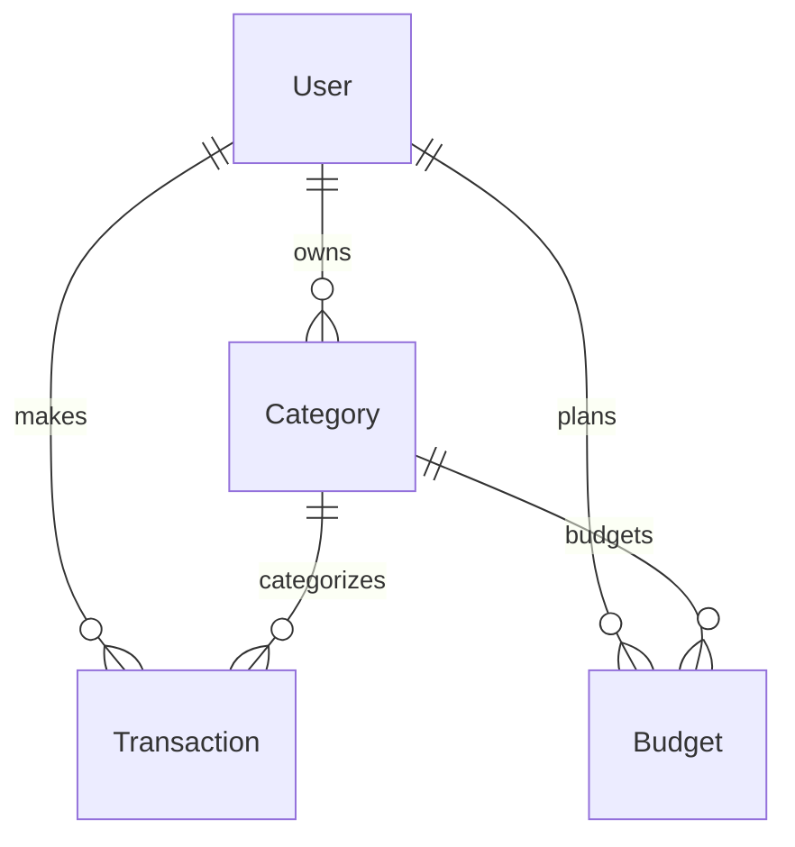

# ERD Diagram

```mermaid
erDiagram
    User ||--o{ Category : owns
    User ||--o{ Transaction : makes
    User ||--o{ Budget : plans
    Category ||--o{ Transaction : categorizes
    Category ||--o{ Budget : budgets
```

- A **User** can have many **Categories**, **Transactions**, and **Budgets**
- A **Category** can be used in many **Transactions** and **Budgets**
